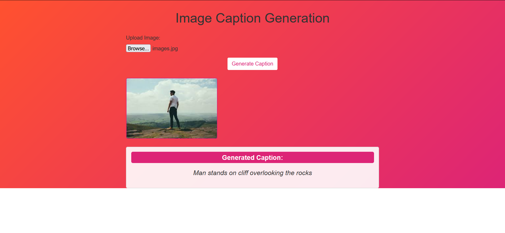
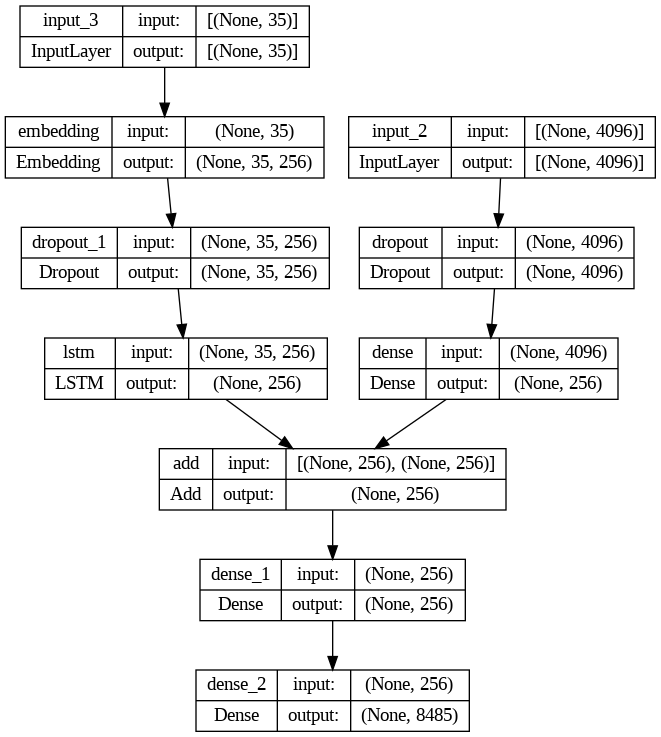

# Screenshots



# Image Captioning Flask Web App

This repository contains a Flask web application that utilizes an image captioning model based on the encoder-decoder architecture. The model generates captions for images provided by users through the web interface. The model uses a pre-trained VGG model to extract image features and an LSTM-based decoder to generate captions for the given images.

## Usage

1. Clone this repository to your local machine:

```bash
git clone https://github.com/your-username/image-captioning-app.git
cd image-captioning-app
```
2. Run the Flask web application:

```bash
python app.py
```

3. Open your web browser and go to `http://localhost:5000`. The web application should now be running.

4. Upload an image using the provided form. Click on the "Generate Caption" button, and the model will process the image and display the generated caption below the uploaded image.

# Image Captioning Model

The image captioning model used in this web application has the following architecture:

    Encoder (Image Feature Extraction):
        Input Layer: A 4096-dimensional vector representing the image features.
        Dropout Layer: To prevent overfitting, with a dropout rate of 0.4.
        Dense Layer: Reduces the dimensionality of the image features to 256 units, using the ReLU activation function.

    Encoder (Sequence Feature Extraction):
        Input Layer: Takes in the tokenized captions as input, with a shape of (max_length,).
        Embedding Layer: Converts integer-encoded tokens into dense vectors of 256 dimensions. The vocab_size parameter indicates the number of unique words in the vocabulary, and mask_zero=True is used to mask zero-padded tokens during training.
        Dropout Layer: Applied to the embedded sequences with a dropout rate of 0.4.
        LSTM Layer: A Long Short-Term Memory (LSTM) layer with 256 units to process the sequence of embedded tokens.

    Decoder Model:
        Combines the image features and sequence features using an element-wise addition (add operation).
        Dense Layer: Processes the combined features with 256 units and ReLU activation.
        Output Layer: A Dense layer with vocab_size units and a softmax activation function to generate the probability distribution over the vocabulary.


